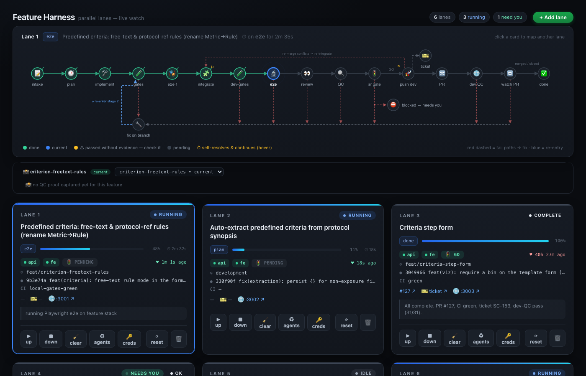
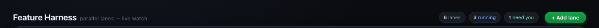
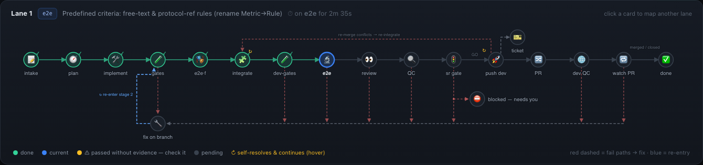
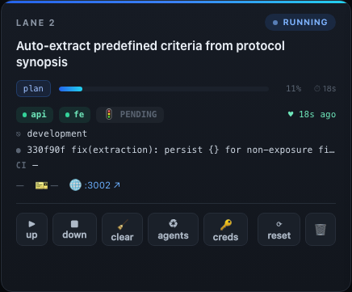
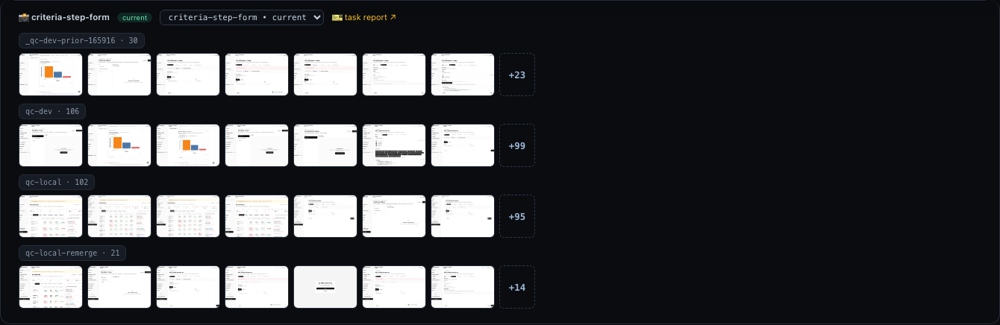
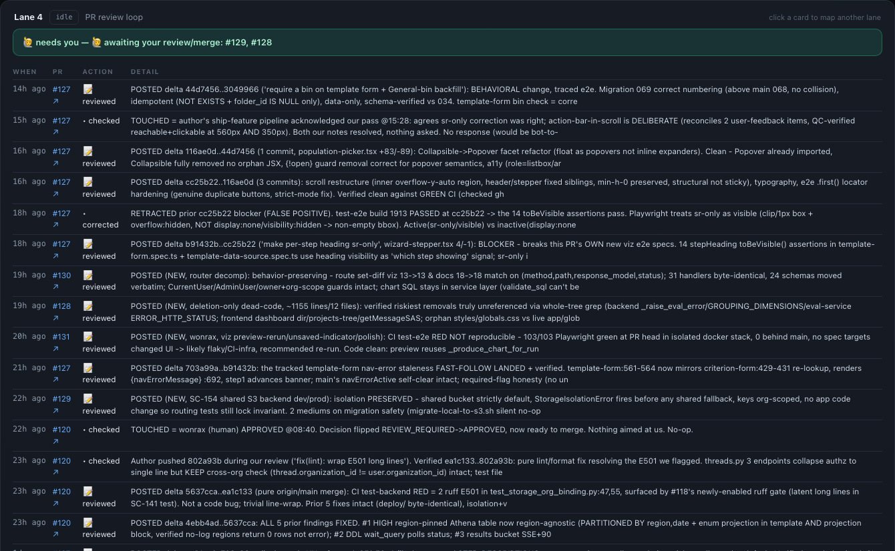

# Parallel Feature Harness

Build, QC, and ship multiple features in parallel in isolated lanes—full app clones with dedicated ports, databases, and Redis instances. Describe a feature in a sentence, and `/ship-feature` takes it from implementation to delivery while leaving your own checkout untouched.

```
intake → plan → implement → CI gates → e2e (feature) → integrate → dev CI gates
→ e2e (dev) → code review → browser QC → senior GO/NO-GO → push → open PR
→ dev QC + ticket → watch PR until merged
```



The harness is **project-agnostic**: everything stack-specific lives in a
**profile** (`profiles/<name>/`), with a bundled `profiles/clinical/` as the
worked example. To run it against your own repo, see
[Adopting for your own project](#adopting-for-your-own-project).

---

## Setup

### Prerequisites

| Tool | Why |
|---|---|
| **git**, **Docker** | clone/branch/merge lanes; the one shared Postgres + Redis all lanes use |
| **Node ≥ 18** | the dashboard + the Playwright MCP servers (browser QC). The newest ≥18 is auto-selected at runtime, so multiple Node versions coexist fine |
| **gh** (authenticated) | PRs, CI status, the review loop |
| **python3** | `bin/` helper scripts (stdlib only) |
| **flock** | cross-lane locking (macOS: `brew install flock`; Linux: usually preinstalled) |
| **Claude Code** | runs `/ship-feature` + `/review-prs`. The installer auto-adds the **superpowers** plugin; `code-review` is built in |
| **your app's toolchain** | whatever your repo builds/tests with — invoked through your profile's hooks, never by the harness |

Your app repo must already clone, install, and run locally on its own — the
harness builds on top of it.

### Configure — the two env files

Everything you set lives in `config/`:

- **`config/lanes.env`** — non-secret topology. Defaults work out of the box; for
  your own app set at least `PROFILE` and `SOURCE_REPO`:
  ```bash
  PROFILE="myapp"                  # uses profiles/myapp/
  SOURCE_REPO="$HOME/work/myapp"   # the app repo lanes clone from
  LANES_ROOT="$HOME/work"          # where laneN/ clones are created
  DB_PREFIX="myapp_l"              # lane N DB = myapp_l<N>
  # Override only if they clash:
  # API_BASE_PORT=8000  FE_BASE_PORT=3000  PG_PORT=5433  REDIS_PORT=6379
  # COMPOSE_FILE="$SOURCE_REPO/docker-compose.yml"
  ```
- **`config/secrets.env`** — credentials (gitignored). Copy the example and fill
  it in:
  ```bash
  cp config/secrets.env.example config/secrets.env
  ```
  | Key | For |
  |---|---|
  | `SEED_USER_EMAIL` / `SEED_USER_PASSWORD` | the local seed account each lane DB gets (also the qc-local login) |
  | `DEV_QC_PASSWORD` | per-lane dev-QC accounts (dev-site QC integration) |
  | `TRACKER_EMAIL` / `TRACKER_PASSWORD` | tracker login (ticketer integration) |
  | `QC_UPLOAD_FIXTURES_DIR` | absolute path to upload fixtures; blank = skip upload scenarios |

  Your app's own LLM/API keys stay in your repo's `backend/.env` — each lane's
  `.env` is seeded from it with `DATABASE_URL` / `REDIS_URL` / `UPLOAD_DIR`
  rewritten per lane, so isolation holds.

### One-time setup

Run from the harness repo root:

```bash
bin/db-shared-up.sh             # shared Postgres + Redis (one set for all lanes)
bin/install-claude-assets.sh    # copy skills + agents into ~/.claude (+ superpowers plugin)
bin/dashboard.sh start          # → http://127.0.0.1:8090
```

> `install-claude-assets.sh` *copies* the skills/agents (it bakes in install-time
> paths), so **re-run it after editing any source skill/agent** and **restart open
> Claude sessions** — skills, agents, and plugins load at session start.

### Add a lane

Click **+ Add lane** in the dashboard top bar — it provisions the next free lane
end to end (clone → deps → DB → MCP config → agents). Or from a terminal:

```bash
bin/lane-bootstrap.sh 1     # run from a terminal so it can prompt for the dev-QC account
```

Lanes 1–9 are supported; 3–5 live at once is typical. Each runs its own API
(`:800N`) and frontend (`:300N`).



### Run a feature

```bash
cd ../lane1 && claude
# /ship-feature "Add a CSV export button to the reports table"
```

Answer the opening questions once, then watch the dashboard. The lane runs
unattended and only stops on a genuine blocker (an escalated senior NO-GO, an
ambiguous merge conflict) — the reason shows in the card's **notes**.

---

## Usage

### Multiple features at once

Open a separate terminal/session per lane — they're fully isolated and run in
parallel:

```bash
# Terminal 1                          # Terminal 2
cd ../lane1 && claude                 cd ../lane2 && claude
# /ship-feature "Feature A"          # /ship-feature "Feature B"
```

Prefer a front door? `bin/lane-assign.sh "Feature A"` reserves + boots the next
free lane and prints the exact `cd … && claude` + `/ship-feature` to run.

### Review open PRs instead — `/review-prs`

Dedicate a lane to reviewing PRs:

```bash
cd ../lane4 && claude
# /review-prs
```

After a short scope Q&A it polls open PRs and posts substantive feedback on any
that are new, have new commits, or have new discussion aimed at it — never
merging, pushing, or closing. A per-lane cursor means it never re-reviews
unchanged PRs. The dashboard shows a **review-history table** for that lane
instead of the pipeline map.

### Switching features on a lane

When a feature is done: click **🧹 clear** (archive its state + reset the status
fields), then **⟳ reset** if the next feature needs a clean branch + fresh DB,
then assign the new one (`cd ../laneN && claude` → `/ship-feature "…"`). Cleared
features stay browsable in the proof gallery's feature picker.

### Manual testing & lifecycle

Each lane's live app is at `http://localhost:300N` (log in with your seed
account) — open several at once. Lane lifecycle is on the dashboard card buttons
(see [Features](#features)) or the [CLI](#cli-reference). Lanes serve production
builds (no hot reload), so after hand-editing a lane run `bin/lane-up.sh N` to
rebuild.

> **Resource note:** heavy steps (FE build, e2e, the integration push) are
> serialized across lanes; dev-site QC runs in parallel. Idle lanes are light
> (~340 MB each) — run fewer if memory is tight. Don't `docker compose stop` the
> shared DB while lanes are up.

---

## Features

### Pipeline map

Click any lane card to see its pipeline map — every stage, color-coded:



| Color | Meaning |
|---|---|
| **Green** | Done — stage completed successfully |
| **Blue** | Current — running now |
| **Amber** | Passed without evidence — worth verifying it ran |
| **Gray** | Pending — not reached yet |
| **Red dashed** | Fail path — leads to fix-on-branch, then re-entry |

### Lane cards & actions



Each card shows, at a glance: **feature title** and current **stage** with a
progress bar, a **⏱ time-on-phase** timer, **stack health** (api/fe up/down),
the **gate decision** (GO / NO-GO / pending), **git branch + latest commit**,
**CI status**, **PR / ticket / test-URL** links, a **heartbeat** (flags
**STALLED** if a running lane stops reporting), and **notes**.

All lane management is on the card — no CLI needed for day-to-day use:

| Button | What it does |
|---|---|
| **▶ up** | Boot/rebuild the lane stack (api + worker + frontend) |
| **■ down** | Stop the lane (kills processes, frees ports); code + DB preserved |
| **🧹 clear** | Archive the feature's state and reset status fields — the "done with this feature" tidy-up |
| **♻ agents** | Re-push current harness templates into the lane (agents + MCP config). Use after editing harness files |
| **🔑 creds** | Set/change the lane's dev-QC account, then re-embed it in the agents + re-seed sessions |
| **⟳ reset** | Clean integration branch + fresh DB seed (confirms first) |
| **🗑 remove** | Delete the lane entirely — clone + DBs + state (confirms first) |
| **＋ add lane** | (top bar) provision the next free lane |

> After **♻ agents** or **🔑 creds**, restart that lane's Claude session — agents
> and MCP servers load at session start.

### QC proof gallery

The selected lane's panel shows thumbnails of every screenshot the QC agents
captured, grouped per feature and per phase:



- **qc-local** — the local browser-QC agent (against the lane's merged stack)
- **qc-dev** — the background dev-site QC agent (against the deployed dev site)
- Click a thumbnail for a full-size lightbox; click **+N** for the full gallery
- A **🎫 task report** link appears once the ticketer agent has written one
- The **feature picker** switches the whole detail panel to a past feature's
  archived state (final stage, gate, PR/ticket links) while the lane keeps running

### PR review mode

When a lane is running `/review-prs`, clicking its card shows a **review-history
table** (PR # · action · when · summary) instead of the pipeline map:



---

## Adopting for your own project

Everything stack-specific lives in one **profile** at `profiles/<name>/`. `bin/`,
`dashboard/`, and the skills/agents stay generic; `profiles/clinical/` is the
worked reference. A profile has five parts:

| File | What |
|---|---|
| `profile.env` | stack shape — DB driver, API path, service dirs, branch names, compose service names |
| `hooks/` | 7 small scripts the engine calls for stack-specific steps (below) |
| `integrations.env` | optional tracker / dev-site-QC / CI-deploy-wait toggles (off ⇒ that stage is skipped) |
| `review-checks.md` | stack-specific senior-gate / PR-review checks (empty ⇒ generic review) |
| `tracker-notes.md` | provider login + idempotency notes for the ticketer (empty ⇒ plain email+password login) |

**The fast path** — in a Claude Code session, run **`/harness-adapt`**. It
inspects your repo (package managers, framework, build/test/migrate commands,
compose services, branches), drafts `profiles/<name>/` from `_template`, asks you
to confirm what it can't infer, validates with `harness-doctor`, and dry-runs a
lane. By hand: `cp -R profiles/_template profiles/myapp`, fill `profile.env`, and
replace each hook's TODO stub using `profiles/clinical/hooks/*.sh` as the example.

Then set `PROFILE` + `SOURCE_REPO` in `config/lanes.env` and validate until clean:

```bash
bin/harness-doctor.sh myapp     # fix every ✗ (stub hooks, missing config) → 0 errors
```

### Hook contract

Before calling any hook, the engine exports a stable env contract — use these in
your hooks: `LANE` / `LANE_DIR`, `API_PORT` / `FE_PORT`, `DATABASE_URL` /
`REDIS_URL` / `UPLOAD_DIR`, `DB_NAME`, `API_BASE` / `FE_URL`, `RUN_DIR` /
`LOG_DIR`, `PROFILE_DIR` / `SOURCE_REPO` / `HARNESS_ROOT`, plus everything in your
`profile.env`. Two helpers are available: `harness_spawn <name> <workdir> <cmd…>`
(background a service with detached stdio + pid/log tracking — use in `boot`) and
`die <msg>`.

| Hook | Must do | Notes |
|---|---|---|
| `bootstrap` | install deps in the lane clone | — |
| `migrate` | apply DB migrations to `DATABASE_URL` | — |
| `seed` | create the initial user/org | `SEED_USER_*` exported |
| `boot` | build + start services, then **return** | use `harness_spawn`; `$1 == --no-build` ⇒ reuse build |
| `health` | exit 0 only when fully ready | prefer `curl --retry` |
| `ci-gate` | lint / test / contract; non-zero on failure | gets an isolated `TEST_DATABASE_URL` |
| `e2e` | run e2e against the running stack, under the e2e lock | `with-lock.sh e2e -- <cmd>` |

DB create/drop and Redis-index assignment stay harness-side (driven by your
`PG_*` / `COMPOSE_SERVICES` / `DB_PREFIX`) — the harness assumes **Postgres +
Redis via your repo's docker-compose**.

### Integrations

Each is off by default; turn on what you have in `integrations.env`:

- **Tracker** (`TRACKER_ENABLED=1`) — file a ticket after a push. Set
  `TRACKER_PROVIDER`, `TRACKER_URL`, `TRACKER_PROJECT`, `TRACKER_STATUS`,
  `TRACKER_ASSIGNEE`, `TRACKER_MCP`. One sample provider ships as a worked
  example; for others, write the login + search notes in `tracker-notes.md`.
- **Dev-site QC** (`DEV_QC_ENABLED=1`) — browser-QC a deployed dev site after
  push. Set `DEV_SITE_URL`, `DEV_QC_MCP`. Each lane uses its own dev account
  (password `DEV_QC_PASSWORD`); the account must exist on your dev server.
- **CI deploy-wait** (`CI_WAIT_ENABLED=1`) — wait on a deploy before dev-QC. Set
  `CI_REPO` + `CI_DEPLOY_CONTEXT` (a GitHub commit-status context; works for
  CircleCI, GH-Actions, etc.).

The QC/tracker agents drive Playwright MCP servers **by the names you set**;
register those servers in your source project's MCP config (`harness-doctor`
reminds you which names each enabled integration expects).

---

## Troubleshooting

| Symptom | Fix |
|---|---|
| Lane shows **STALLED** | no heartbeat for >15 min — its Claude likely died; `cd ../laneN && claude` to resume (tune with `STALL_SEC=… bin/dashboard.sh restart`) |
| Lane session missing an MCP | `bin/lane-mcp-sync.sh N`, then restart the lane's Claude session (MCPs load at start) |
| Agent can't post a PR comment | per-lane allow-rules load at session start — restart the lane's Claude session after first provisioning |
| Server won't boot | check `logs/laneN/{api,fe,worker}.log` |
| `flock: command not found` | `brew install flock` (macOS) |
| `harness-doctor` shows stub hooks | implement `profiles/<name>/hooks/*.sh` |

---

## CLI reference

Most operations are on the dashboard; these are for scripting or terminal use.

```bash
# Setup
bin/db-shared-up.sh                    # shared Postgres + Redis
bin/install-claude-assets.sh           # skills + agents → ~/.claude (+ superpowers)
bin/dashboard.sh start|stop|restart    # watch UI → :8090
bin/harness-doctor.sh [profile]        # validate a profile's config + hooks

# Lanes (also on the dashboard)
bin/lane-bootstrap.sh N                # provision lane N
bin/lane-add.sh [--and-up]             # provision the next free lane
bin/lane-assign.sh "feature"           # pick + boot a free lane, print the run command
bin/lane-up.sh N | bin/lane-down.sh N  # boot/rebuild | stop a lane
bin/lane-reset.sh N | bin/lane-remove.sh N   # clean dev + reseed | delete entirely
bin/lane-status.sh                     # status table for all lanes

# Maintenance
bin/lane-mcp-sync.sh N|--all           # re-sync MCP config to lane(s)
bin/lane-agents-install.sh N|--all     # regenerate per-lane agents with current creds
bin/lane-qa-login.sh N [dev|local|all] # re-seed a lane's browser login session
```

---

## Layout & what's not in git

```
<parent>/                  # e.g. ~/work — set by LANES_ROOT / SOURCE_REPO in config/lanes.env
├─ <your-app-repo>/        # your app (you provide; SOURCE_REPO points here)
├─ harness/                # this repo — engine, dashboard, skills, agents
│   ├─ bin/                # lifecycle scripts (generic)
│   ├─ dashboard/          # watch UI — Node + React (generic)
│   ├─ claude/             # skill + agent templates (generic)
│   ├─ profiles/           # per-project config: <name>/ + _template/ + clinical/ (example)
│   ├─ config/             # lanes.env + secrets.env (gitignored)
│   └─ docs/screenshots/   # the images in this README
└─ lane1/ lane2/ …         # lane clones (the harness creates these)
```

- **You edit:** `profiles/<name>/`, `config/lanes.env`, `config/secrets.env`.
  That's it for a normal adoption.
- **Generic (don't touch):** `bin/`, `dashboard/`, the skills, and the agent
  *templates* — they read your injected config.
- **Never committed** (gitignored): `config/secrets.env`, `state/`, `run/`,
  `logs/`, `locks/`, and per-lane credential files inside each lane clone
  (`<lane>/.harness-qa.env`, `<lane>/.claude/agents/*.md`). Passwords never enter
  git.
